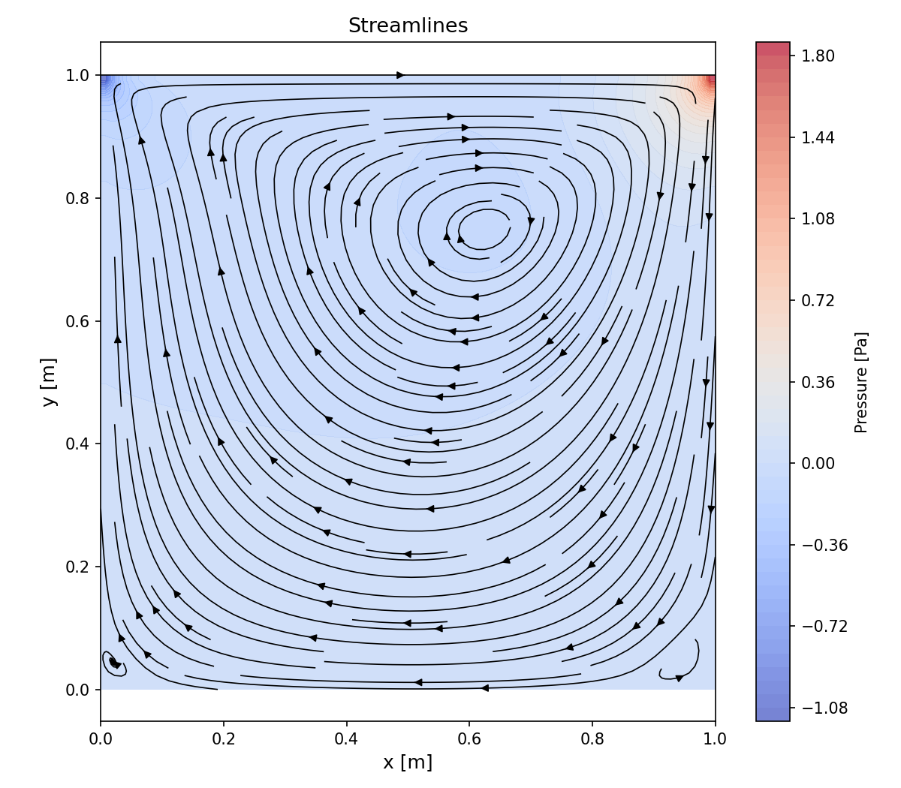
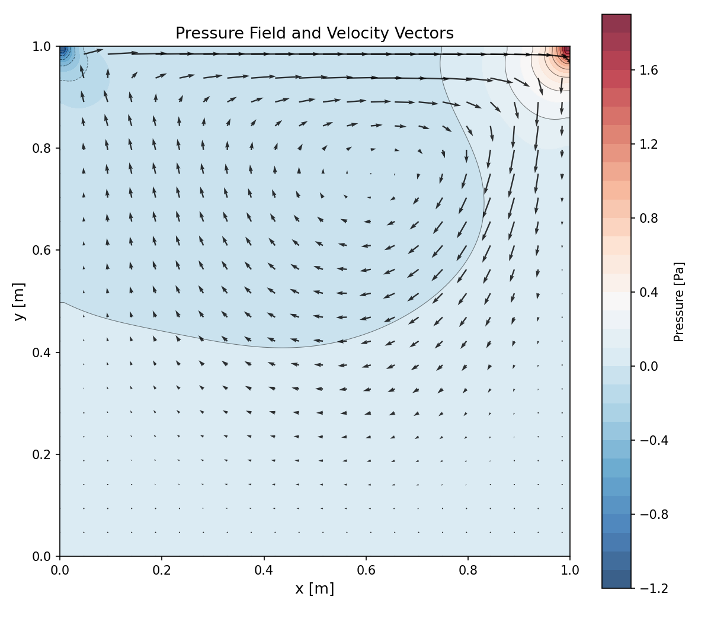
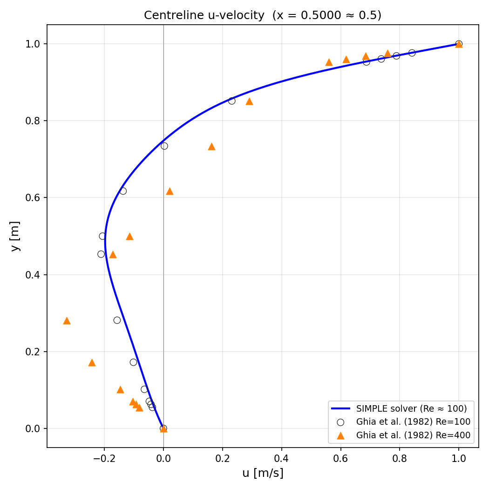
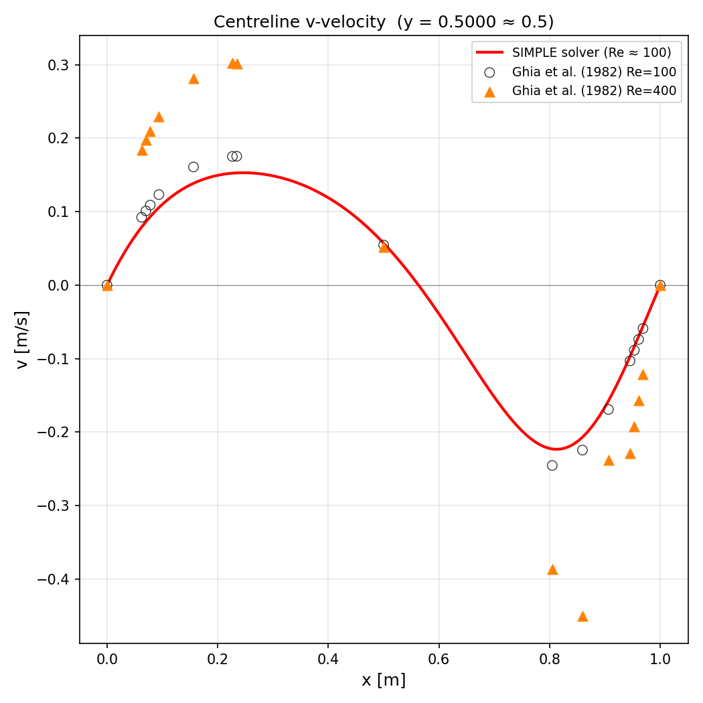
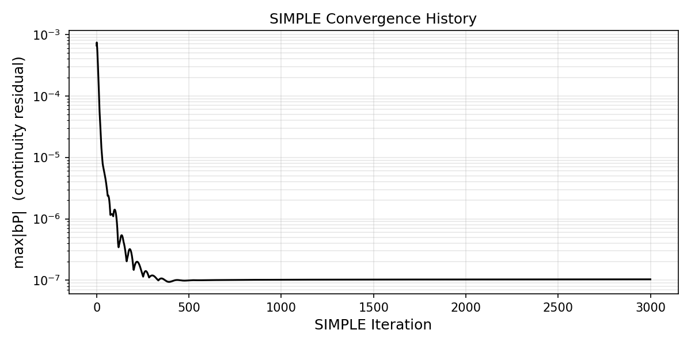
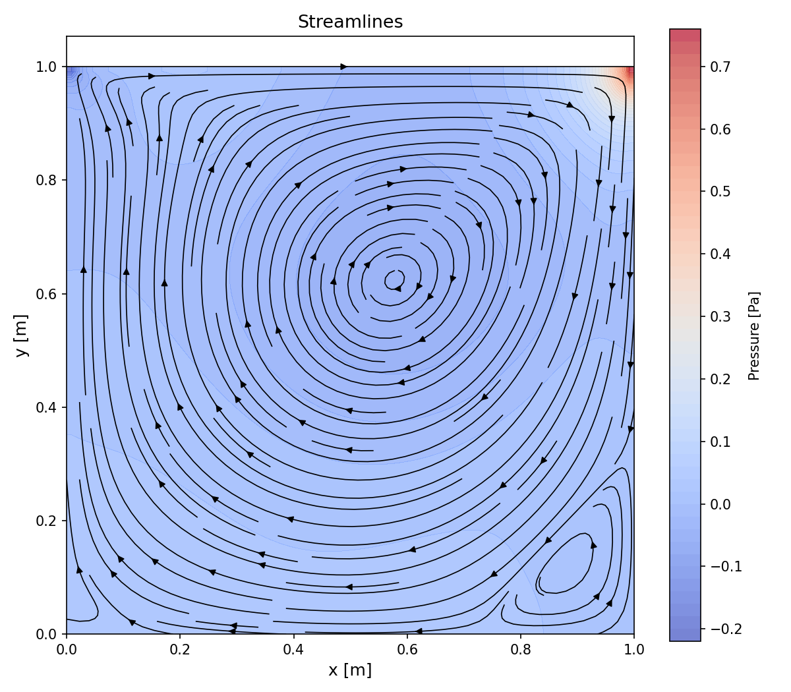
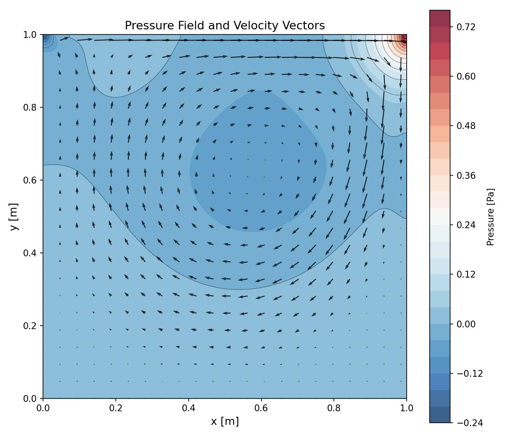
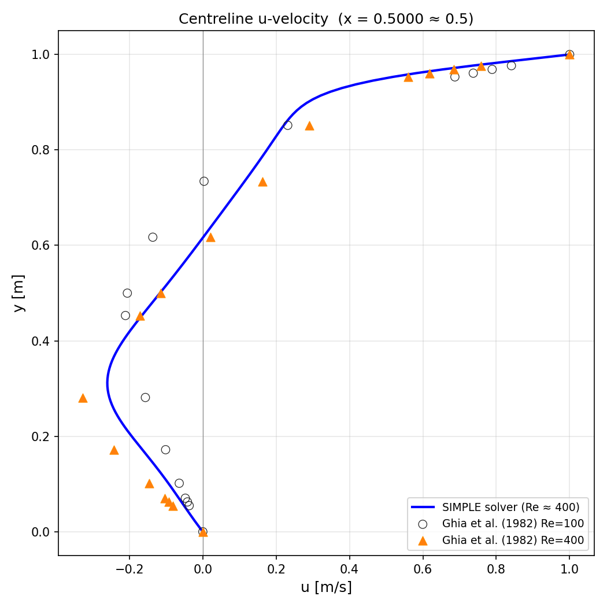
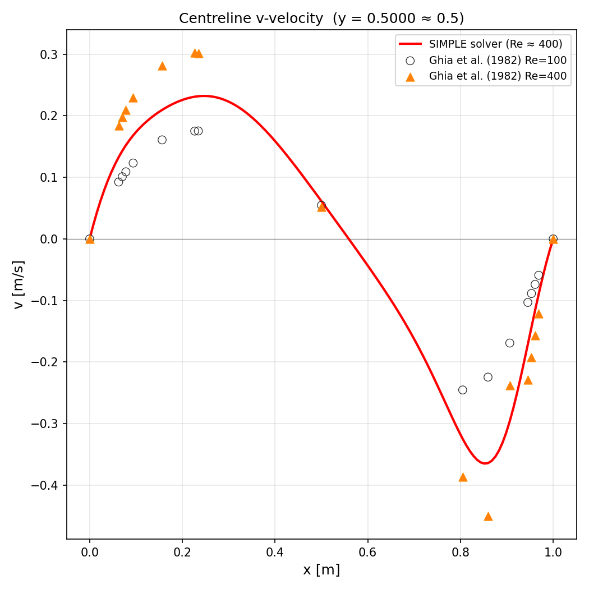

# simple-fvm-from-scratch

A complete, from-scratch 2D incompressible Navier–Stokes solver built to teach how SIMPLE and the Finite Volume Method actually work — equation by equation, line by line.

---

## Quick Start

```bash
pip install numpy matplotlib
python run_simulation.py
```

This runs a lid-driven cavity simulation at Re = 100 on a 129×129 grid using central differencing. You'll see convergence output and plots saved to `results/`: pressure contours, streamlines, and centreline velocity comparisons against the Ghia et al. (1982) benchmark.

---

## What's Inside

| Component | Method |
|---|---|
| Spatial discretisation | Finite Volume Method, uniform collocated Cartesian grid |
| Pressure–velocity coupling | SIMPLE algorithm (Patankar, 1980) |
| Checkerboard fix | Rhie–Chow interpolation |
| Convection schemes | Upwind (UDS), Central Differencing (CDS), Second-Order Upwind (SOU) |
| Linear solver | Gauss–Seidel iteration |
| Dependencies | `numpy` only (`matplotlib` for plots) |

---

## Repository Layout

```
simple-fvm-from-scratch/
│
├── run_simulation.py          ← entry point (single case)
├── requirements.txt
│
├── solver/                    ← one file per concept
│   ├── grid.py                ← mesh geometry
│   ├── fields.py              ← field arrays (u, v, p, p', bP)
│   ├── discretization.py      ← FVM coefficient assembly
│   ├── convection_schemes.py  ← UDS, CDS, SOU schemes
│   ├── momentum.py            ← u* and v* prediction
│   ├── pressure.py            ← pressure-correction equation
│   ├── rhie_chow.py           ← face velocity interpolation
│   ├── simple.py              ← outer SIMPLE loop
│   ├── linear_solvers.py      ← Gauss–Seidel solver
│   └── boundary_conditions.py ← velocity and pressure BCs
│
├── theory/                    ← step-by-step derivations (start here)
│   ├── README.md              ← reading roadmap with dependency graph
│   ├── 01_what_problem_are_we_solving.md
│   ├── 02_finite_volume_discretization.md
│   ├── 03_momentum_equations.md
│   ├── 04_pressure_velocity_coupling.md
│   ├── 05_simple_algorithm.md
│   ├── 06_gauss_seidel_solver.md
│   ├── 07_rhie_chow_interpolation.md
│   └── 08_lid_driven_cavity_setup.md
│
├── post/
│   └── plot_results.py        ← visualisation + Ghia comparison
│
└── results/                   ← saved plots (PNGs committed)
```

Every equation in the `theory/` notes has a direct counterpart in the `solver/` code. Each theory chapter ends with a table mapping concepts to files and functions.

---

## Changing Parameters

Edit `run_simulation.py`:

```python
# Reynolds number (change nu)
nu = 1e-2     # Re = 100  (default, fast convergence)
nu = 2.5e-3   # Re = 400  (increase n_iter to ~2000)
nu = 1e-3     # Re = 1000 (use 81×81 or larger grid)

# Grid resolution
nx, ny = 129, 129  # default
nx, ny = 41, 41    # fast, good for Re=100 testing
nx, ny = 256, 256  # high resolution

# Under-relaxation (reduce if diverging)
urf_u, urf_v = 0.7, 0.7   # momentum
urf_p = 0.3                # pressure

# Inner solver sweeps
gs_mom = 20   # Gauss–Seidel sweeps for momentum
gs_p   = 100  # Gauss–Seidel sweeps for pressure correction

# Convection scheme
convection_scheme = SCHEME_CDS  # central differencing (default)
convection_scheme = SCHEME_UDS  # first-order upwind
convection_scheme = SCHEME_SOU  # second-order upwind (deferred correction)
```

---

## Results

### Re = 100, Central Differencing (129×129 grid)

| Streamlines | Pressure + velocity |
|---|---|
|  |  |

| u-centreline vs Ghia | v-centreline vs Ghia |
|---|---|
|  |  |

| Convergence history |
|---|
|  |

### Re = 400, Central Differencing (129×129 grid)

| Streamlines | Pressure + velocity |
|---|---|
|  |  |

| u-centreline vs Ghia | v-centreline vs Ghia |
|---|---|
|  |  |

---

## Troubleshooting

| Symptom | Likely cause | Fix |
|---|---|---|
| Residual diverges to infinity | Under-relaxation too aggressive | Reduce `urf_u`, `urf_v` to 0.3 |
| Very slow convergence | Too few pressure sweeps | Increase `gs_p` to 150 |
| Checkerboard in pressure plot | Bug in Rhie–Chow or `au_P_arr` | Check `au_P_arr` is not all-ones |
| Vortex not forming | Lid BC not enforced during solve | Verify `apply_velocity_bcs` is called after each G-S sweep |
| Centreline profiles shifted from Ghia | Grid too coarse or first-order scheme | Increase to 129×129, try CDS or SOU scheme |

---

## Validation

Benchmark: Ghia, U., Ghia, K.N., & Shin, C.T. (1982). *High-Re solutions for incompressible flow using the Navier–Stokes equations and a multigrid method.* Journal of Computational Physics, **48**(3), 387–411.

At Re = 100, the primary vortex centre should be near (0.617, 0.737). Centreline velocity profiles match Ghia within 2–5% on a 129×129 grid with central difference scheme. With first-order upwind the discrepancy is larger due to numerical diffusion.

---

## References

- Patankar, S.V. (1980). *Numerical Heat Transfer and Fluid Flow*. Hemisphere Publishing.
- Ferziger, J.H. & Peric, M. (2002). *Computational Methods for Fluid Dynamics*. Springer.
- Rhie, C.M. & Chow, W.L. (1983). Numerical study of the turbulent flow past an airfoil with trailing edge separation. *AIAA Journal*, **21**(11), 1525–1532.
- Ghia, U., Ghia, K.N., & Shin, C.T. (1982). *Journal of Computational Physics*, **48**(3), 387–411.
